# webview_in_flutter

Menambahkan widget WebView ke Aplikasi Flutter
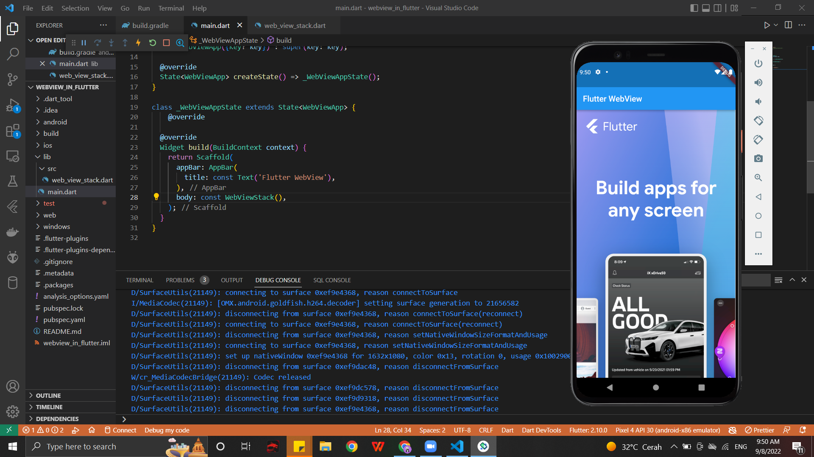
Menggunakan WebViewController
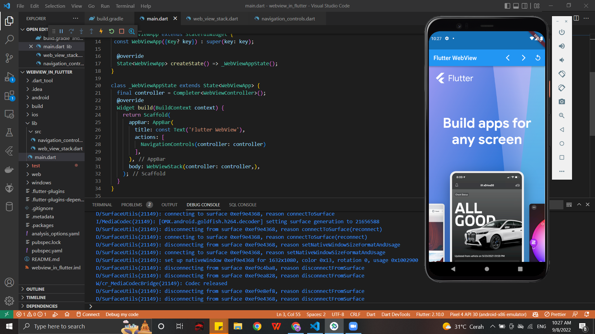
Menambahkan tombol menu ke AppBar
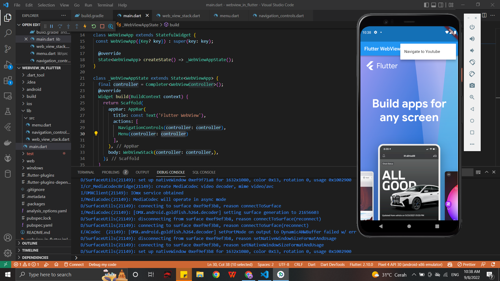
Mengevaluasi JavaScript
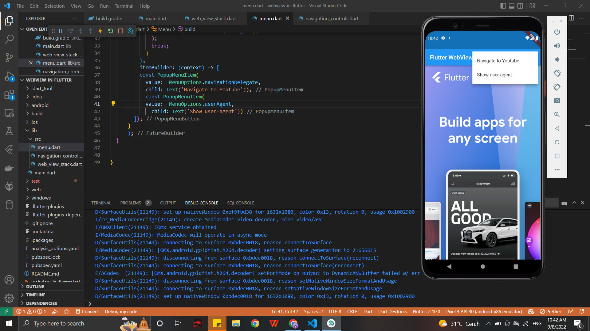
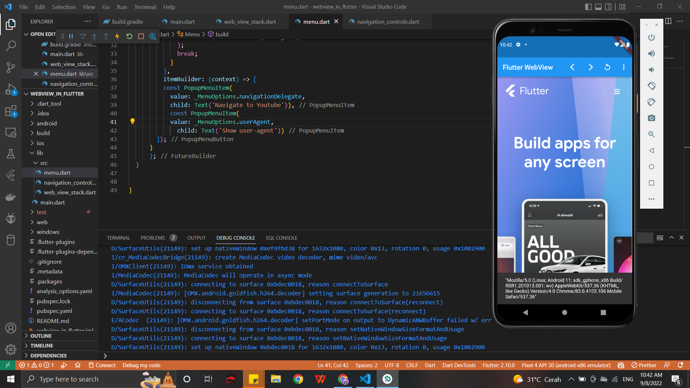
Menggunakan Saluran JavaScript
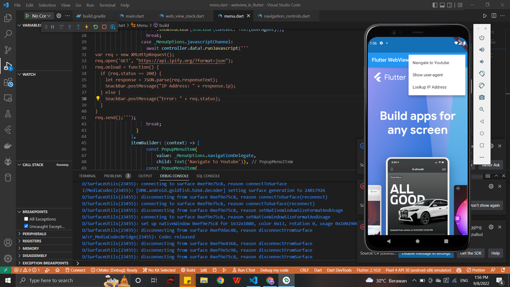
Mengelola Cookie
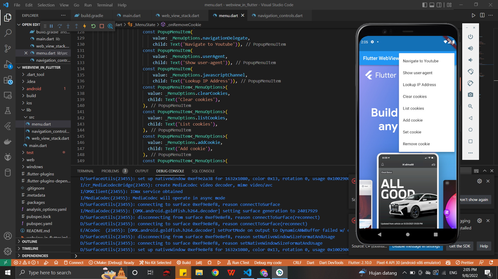
onClearCookies

setCookie

removeCookie

listCookie
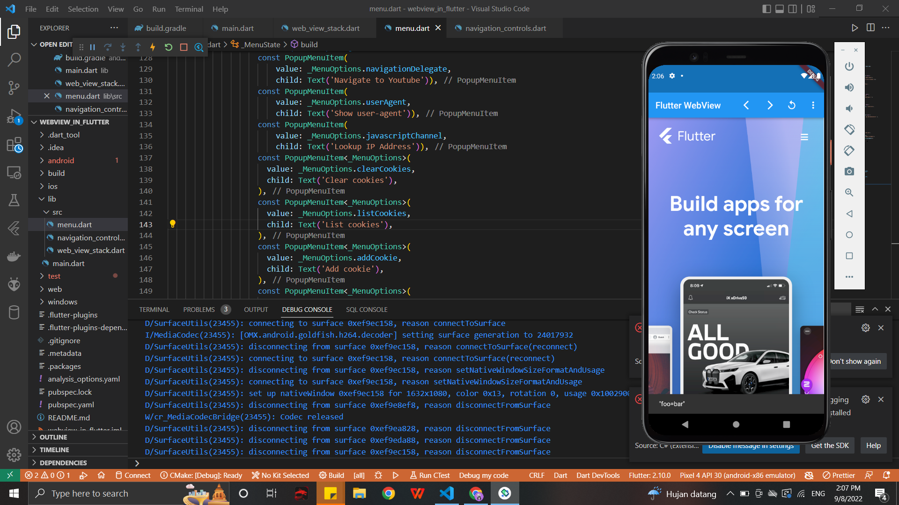
Memuat aset, file, dan string HTML Flutter di WebView
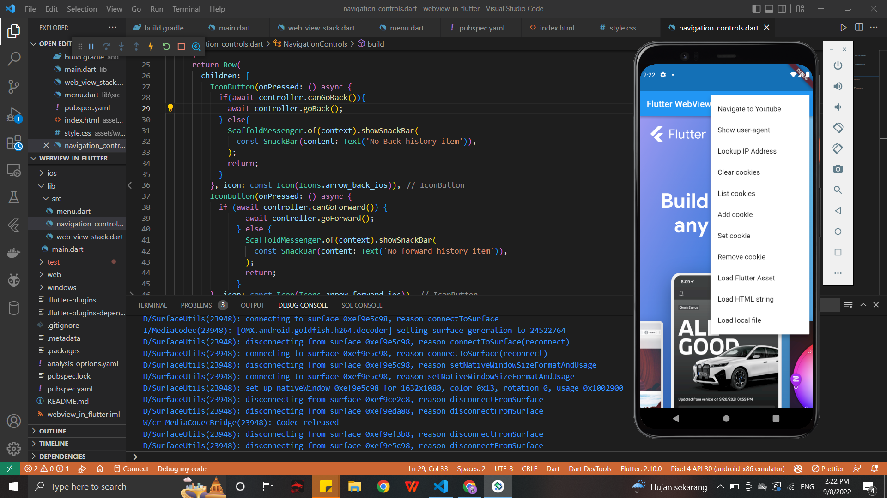
Load Flutter Asset
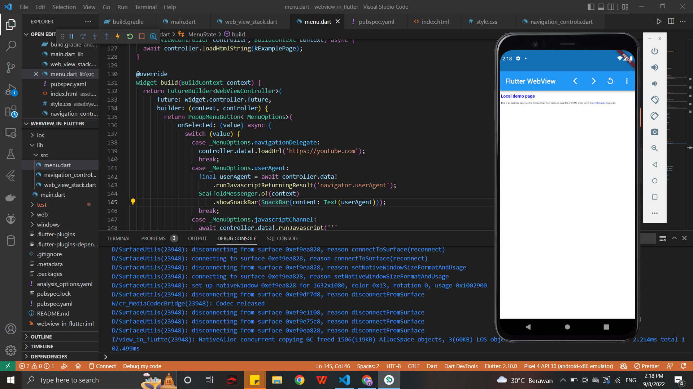
Load HTML String

Load Local File
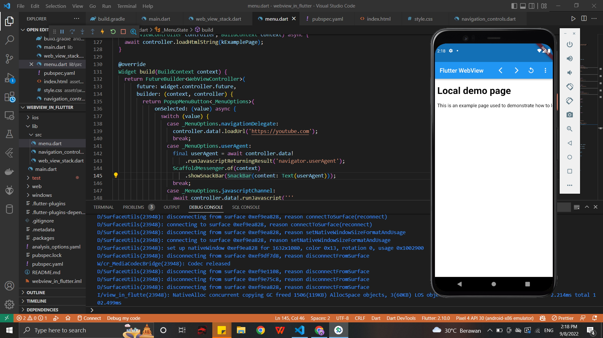
